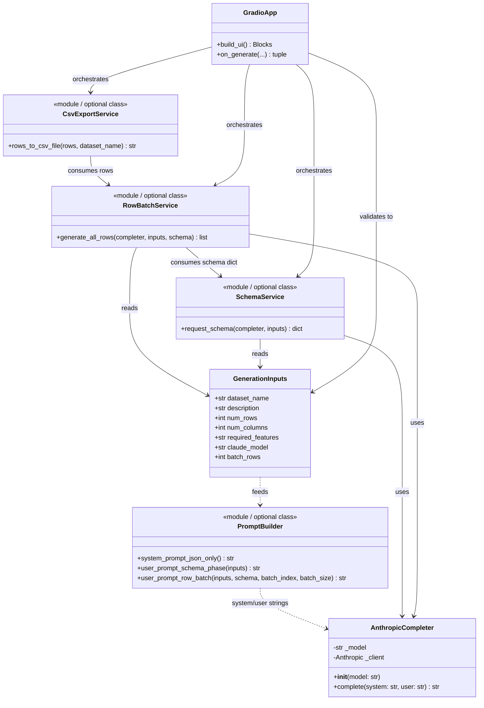
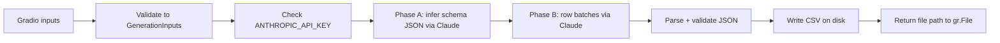

# Synthetic Dataset Generator (Gradio + Anthropic): Learning Guide & Codebase Outline

This document describes a **single-provider** app: **Anthropic (Claude)** only. You practice **LLM engineering** through prompting, structured JSON outputs, batched generation, and safe secrets handling.

**Important:** All **dataset parameters** (name, description, row/column counts, optional feature constraints, Claude model id, and optional batch size) come from **Gradio inputs**. Do **not** store those values in a `config.py` file—the user is the source of truth at runtime. The only configuration that belongs outside the UI is the **API key** in `.env` (see below).

---

## 1. What you are learning (and why it matters)

| Concept | How this project practices it |
|--------|-------------------------------|
| **Prompt design** | You turn Gradio fields into system/user messages Claude can follow. |
| **Structured generation** | CSVs are produced by parsing **JSON** (arrays of objects), not raw prose. |
| **Reliability & limits** | Large `rows × columns` tables break single-shot JSON. **Schema first, then batched rows** is the standard pattern. |
| **Anthropic Messages API** | One client (`anthropic`), non-streaming completion, model id from the user. |
| **App integration** | Gradio wires inputs to a handler that returns a **downloadable CSV file**. |
| **Operational hygiene** | `ANTHROPIC_API_KEY` lives in `.env`, never in code or the UI. |

---

## 2. Problem statement

Build a **Gradio** app whose **inputs** define the job:

| Gradio input | Required? | Role |
|--------------|-------------|------|
| Dataset name | Yes | Labels the dataset; used in filenames and prompts. |
| Dataset description | Yes | Domain, realism, correlations, edge cases. |
| # of rows | Yes | Target row count for the CSV. |
| # of columns | Yes | Target column count (schema width). |
| Required features & explanations | No | Explicit variables, allowed values, ranges (e.g. `house_type`, `monthly_rent`). |
| Claude model | Yes | Anthropic model id (e.g. `claude-sonnet-4-20250514`)—**typed or chosen by the user** in the UI. |
| Rows per API call (batch size) | Optional | How many rows to ask for per request; if empty, your code uses a **local default inside a function** (not `config.py`). |

**Generate** calls the Anthropic API, builds a CSV on disk, and returns a path for **Gradio `File`** download.

**`.env`:** only `ANTHROPIC_API_KEY` (and optionally `ANTHROPIC_BASE_URL` if you use a proxy—omit for default Anthropic).

---

## 3. UML class diagram

The diagram below is a **structural** view: what objects/types exist and how they relate. Python may implement some pieces as modules and functions instead of classes; the diagram still helps you reason about responsibilities.



**Reading the diagram**

- **`GenerationInputs`:** A frozen dataclass (or similar) produced by **validating Gradio values**—this is where “user provides dataset params” becomes typed data. In the UI, optional “required features” may be an empty string; validation can map that to `None` if you prefer.
- **`AnthropicCompleter`:** The only LLM adapter; wraps `anthropic.Anthropic` and uses `inputs.claude_model` (not a hardcoded model in a config file).
- **`PromptBuilder`**, **`SchemaService`**, **`RowBatchService`**, **`CsvExportService`:** Can be **functions in modules** (`prompts.py`, `schema.py`, `batches.py`, `csv_export.py`) or small classes—your choice.
- **`GradioApp`:** `app.py` builds components and connects the **Generate** button to validation → schema phase → batch phase → CSV path.

---

## 4. End-to-end flow (activity)



**Phase A (schema):** Ask Claude for a JSON description of columns (names, types, constraints), honoring **required features** when non-empty.

**Phase B (data):** Request batches of rows as JSON arrays until `num_rows` is satisfied, using **`batch_rows`** from the user (or your in-function default).

**Post-process:** Validate keys, write UTF-8 CSV, return path for download.

---

## 5. Environment variables

| Variable | Required? | Notes |
|----------|-------------|--------|
| `ANTHROPIC_API_KEY` | Yes | Read at startup with `load_dotenv()`; never expose in the UI. |

Document `ANTHROPIC_API_KEY` in `.env.example` (placeholder only).

---

## 6. Suggested dependencies

- `gradio` — UI and file download  
- `python-dotenv` — load `.env`  
- `anthropic` — Claude Messages API  

Optional: `pandas` for CSV writing and validation.

---

## 7. Repository / folder layout (no `config.py` for dataset params)

```text
week3/
  dataset_generator_app/          # or flat files under week3/
    __init__.py
    app.py                        # Gradio Blocks: all dataset params as components
    validation.py                 # Gradio values -> GenerationInputs (+ sanity checks)
    anthropic_client.py           # AnthropicCompleter only
    generation/
      __init__.py
      prompts.py                  # Build system/user strings from GenerationInputs
      schema.py                   # Phase A: request + parse schema JSON
      batches.py                  # Phase B: loop using inputs.batch_rows
      csv_export.py               # Write CSV, return path for gr.File
  .env                            # ANTHROPIC_API_KEY only (local, gitignored)
  .env.example
```

**Why no `config.py` for dataset parameters?**  
Course exercises often misuse `config.py` as a second source of truth. Here, **Gradio** holds name, description, dimensions, optional constraints, model id, and batch size. If you need a **fallback** when “rows per API call” is empty, define it as a **constant inside** `batches.py` or as the default argument in `validate_form`—not in a separate project config file that duplicates the UI.

---

## 8. Codebase outline (with docstrings)

Implement in order: **AnthropicCompleter** → tiny JSON → **schema + batches** → CSV → full Gradio form.

### 8.1 `validation.py`

```python
"""Validate Gradio field values before calling Anthropic or writing files."""

from dataclasses import dataclass
from typing import Optional


@dataclass(frozen=True)
class GenerationInputs:
    """All dataset generation parameters supplied by the user through Gradio.

    Attributes:
        dataset_name: Non-empty label; used in prompts and output filename stem.
        description: Non-empty description of domain and desired data behavior.
        num_rows: Positive integer; target number of CSV rows.
        num_columns: Positive integer; target number of columns in the schema.
        required_features: Optional free text listing required columns and value domains.
        claude_model: Anthropic model id (e.g. claude-sonnet-4-*); chosen by the user.
        batch_rows: Rows to request per API call in Phase B; must be >= 1.
    """

    dataset_name: str
    description: str
    num_rows: int
    num_columns: int
    required_features: Optional[str]
    claude_model: str
    batch_rows: int


def validate_form(
    dataset_name: str,
    description: str,
    num_rows: float | int,
    num_columns: float | int,
    required_features: str,
    claude_model: str,
    batch_rows: float | int | None,
) -> GenerationInputs:
    """Convert raw Gradio values into ``GenerationInputs`` with checks.

    Apply reasonable upper bounds inline (e.g. cap max rows/columns) to avoid
    accidental huge requests—those limits are validation rules here, not a
    separate config module.

    Raises:
        ValueError: If mandatory fields are empty or numeric inputs are invalid.

    Returns:
        A frozen ``GenerationInputs`` instance for the generation pipeline.
    """
    ...


def assert_anthropic_env() -> None:
    """Ensure ``ANTHROPIC_API_KEY`` is set in the environment.

    Raises:
        RuntimeError: With a clear, user-facing message if the key is missing.
    """
    ...
```

### 8.2 `anthropic_client.py`

```python
"""Thin wrapper around the Anthropic Messages API for non-streaming completions."""

from anthropic import Anthropic


class AnthropicCompleter:
    """Calls Claude with a system prompt and a user prompt; returns text only.

    The model id is passed per instance so it always matches the user's Gradio input.
    """

    def __init__(self, model: str) -> None:
        """Create a client; API key comes from the environment (``ANTHROPIC_API_KEY``).

        Args:
            model: Anthropic model id selected in the UI.
        """
        ...

    def complete(self, system: str, user: str) -> str:
        """Run a single non-streaming request and return assistant text.

        Args:
            system: Rules (e.g. JSON-only output, schema rules).
            user: Task content (dataset description, schema, batch instructions).

        Returns:
            Raw assistant string to parse as JSON (possibly inside markdown fences).

        Raises:
            API errors from the ``anthropic`` SDK on failure or rate limits.
        """
        ...
```

### 8.3 `generation/prompts.py`

```python
"""Build prompts from ``GenerationInputs`` and intermediate JSON artifacts."""


def system_prompt_json_only() -> str:
    """Return the system message that instructs Claude to emit parseable JSON only."""
    ...


def user_prompt_schema_phase(inputs: "GenerationInputs") -> str:
    """Ask for a JSON object describing columns: names, types, allowed values.

    Must include ``inputs.required_features`` when non-empty.
    """
    ...


def user_prompt_row_batch(
    inputs: "GenerationInputs",
    schema: dict,
    batch_index: int,
    batch_size: int,
) -> str:
    """Ask for a JSON array of length ``batch_size`` matching ``schema``."""
    ...
```

### 8.4 `generation/schema.py`

```python
"""Phase A: one Anthropic call to produce and parse the column schema."""


def request_schema(completer: "AnthropicCompleter", inputs: "GenerationInputs") -> dict:
    """Call Claude with schema-phase prompts and parse the returned JSON object.

    Raises:
        ValueError: If the response is not valid JSON or misses expected structure.

    Returns:
        A dict describing columns for Phase B (shape is up to you; document it).
    """
    ...
```

### 8.5 `generation/batches.py`

```python
"""Phase B: repeated Anthropic calls until ``inputs.num_rows`` rows exist."""

# Default used only when the user leaves "rows per API call" empty in the UI.
_DEFAULT_BATCH_ROWS: int = 50
"""In-function default—not stored in config.py."""


def generate_all_rows(
    completer: "AnthropicCompleter",
    inputs: "GenerationInputs",
    schema: dict,
) -> list[dict]:
    """Loop batch requests using ``inputs.batch_rows`` until enough rows are collected.

    Returns:
        List of row dicts suitable for CSV export.
    """
    ...
```

### 8.6 `generation/csv_export.py`

```python
"""Write rows to a CSV file for Gradio's ``File`` component."""

from typing import Iterable


def rows_to_csv_file(rows: Iterable[dict], dataset_name: str) -> str:
    """Write UTF-8 CSV and return absolute path for download.

    Args:
        rows: Dicts with consistent keys (column names).
        dataset_name: From the user; sanitize for the filename stem.

    Returns:
        Filesystem path string passed to ``gr.File``.
    """
    ...
```

### 8.7 `app.py` (Gradio — all dataset parameters as inputs)

```python
"""Gradio UI: every dataset parameter is a component; Generate runs the pipeline."""

import gradio as gr


def generate_clicked(
    dataset_name: str,
    description: str,
    num_rows: float,
    num_columns: float,
    required_features: str,
    claude_model: str,
    batch_rows: float | None,
) -> tuple[str | None, str]:
    """Validate Gradio inputs, run schema + batches via Anthropic, export CSV.

    Returns:
        ``(file_path_or_none, status_markdown)`` for ``gr.File`` and status text.
    """
    ...


def build_ui() -> gr.Blocks:
    """Build ``gr.Blocks`` with Textbox/Number for dataset params, Generate, File output.

    Include:
        - Dataset name, description, # rows, # columns
        - Optional required-features text
        - Claude model (Textbox or Dropdown with editable value)
        - Optional number for rows per API call (nullable; validation applies default)
    """
    ...


def main() -> None:
    """``load_dotenv()``, ``build_ui().launch()``."""
    ...


if __name__ == "__main__":
    main()
```

---

## 9. Implementation order (recommended)

1. **`.env`** with `ANTHROPIC_API_KEY`; implement **`AnthropicCompleter.complete`** and a one-off JSON array parse.
2. **Gradio** with all inputs above; **`validate_form`** returns **`GenerationInputs`**.
3. **Phase A** (`request_schema`); print schema to status for debugging.
4. **Phase B** (`generate_all_rows`) with **`inputs.batch_rows`**; retries on JSON errors.
5. **`rows_to_csv_file`** and wire **`gr.File`** download.
6. **Polish:** status progress, caps in validation, clearer errors.

---

## 10. Debugging tips

- Log truncated prompts and responses in development.
- Start with a **tiny** grid (e.g. 3 rows, 2 columns) and a small **`batch_rows`**.
- If Claude wraps JSON in markdown fences, strip fences before `json.loads`; retry once with stricter “no markdown” instructions.

---

## 11. Notebook

Use `dataset_generator.ipynb` to experiment with prompts; move stable helpers into `dataset_generator_app/` when satisfied.

---

## 12. Quick start checklist

- [ ] Add `ANTHROPIC_API_KEY` to `.env` and document it in `.env.example`.
- [ ] `pip install gradio python-dotenv anthropic`
- [ ] Implement **`AnthropicCompleter`** and **`build_ui`** with every field sourced from Gradio.
- [ ] Add schema phase, batch phase, CSV export, then tighten validation.

This outline keeps **dataset parameters in Gradio**, **secrets in `.env`**, and **Claude-only** API usage—aligned with a clear object model in the UML class diagram above.
